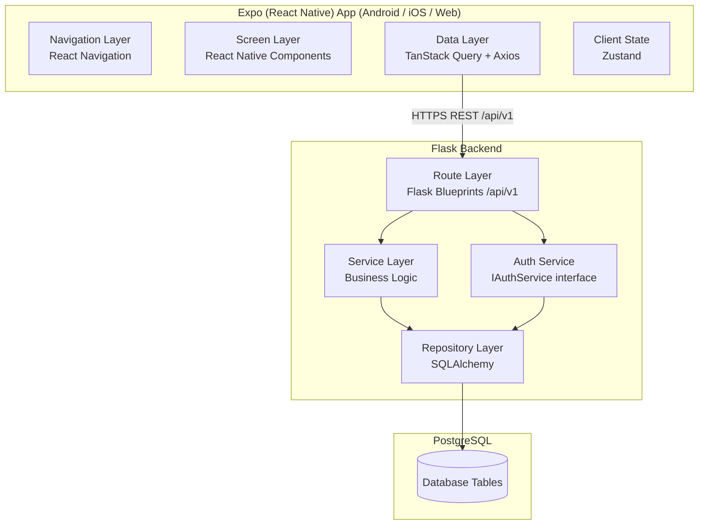
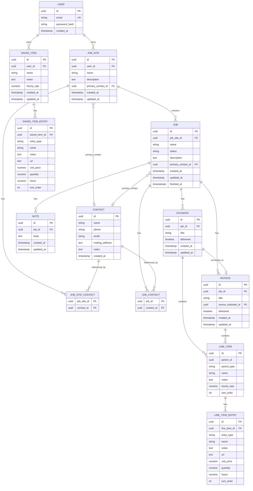

# Design Document

## Contractor Management App

---

## Overview

The Contractor Management App is a mobile-first, cross-platform application that helps small contractors manage their business operations. The system follows a client-server architecture: an Expo (React Native) frontend (Android, iOS, web) communicates with a Python Flask REST API backed by a PostgreSQL database. The frontend is built and developed using `npx expo` as the primary toolchain.

The core workflow is job-site-centric: a contractor organises work into **Job Sites**, each containing one or more **Jobs**. Each Job can have Contacts, Notes, Estimates, and Invoices attached to it. Contact information can be inherited from the parent Job Site when a Job has no directly assigned contacts.

**Key design goals:**
- Simplicity and incrementalism — the architecture should make it easy to add features without restructuring existing code.
- Pluggable authentication — the Auth Service sits behind an interface so alternative providers (OAuth, SSO) can be swapped in later.
- Versioned REST API — all data operations go through `/api/v1/...` endpoints so clients and the backend can evolve independently.
- Layered separation — routes, services, and repositories are distinct layers on the backend; navigation, screens, and data-fetching are distinct layers on the frontend.
- Containerised database — PostgreSQL runs in a Docker container managed by Docker Compose, keeping the local development environment consistent and requiring no local PostgreSQL installation.

---

## Architecture

### High-Level Architecture



### Backend Layers

| Layer | Responsibility | Technology |
|---|---|---|
| Route Layer | HTTP request/response, input validation, auth middleware | Flask Blueprints |
| Service Layer | Business rules, orchestration, domain logic | Plain Python classes |
| Repository Layer | Database queries, persistence, ORM mapping | SQLAlchemy 2.x |
| Auth Service | Registration, login, token issuance/validation | `IAuthService` interface + `EmailPasswordAuthService` impl |

### Frontend Layers

| Layer | Responsibility | Technology |
|---|---|---|
| Navigation | Screen routing, deep links, auth guards | React Navigation 7 |
| Screen | UI rendering, user interaction | React Native components |
| Data Fetching | Server state, caching, mutations | TanStack Query (React Query) |
| Client State | Auth token, UI-only state | Zustand |

### Infrastructure — Docker Compose

PostgreSQL runs in a Docker container. A `docker-compose.yml` at the project root defines the service:

```yaml
version: "3.9"
services:
  db:
    image: postgres:16-alpine
    restart: unless-stopped
    environment:
      POSTGRES_USER: ${POSTGRES_USER:-sitekeeper}
      POSTGRES_PASSWORD: ${POSTGRES_PASSWORD:-sitekeeper}
      POSTGRES_DB: ${POSTGRES_DB:-sitekeeper}
    ports:
      - "5434:5432"
    volumes:
      - postgres_data:/var/lib/postgresql/data

  db_test:
    image: postgres:16-alpine
    restart: unless-stopped
    environment:
      POSTGRES_USER: ${POSTGRES_USER:-sitekeeper}
      POSTGRES_PASSWORD: ${POSTGRES_PASSWORD:-sitekeeper}
      POSTGRES_DB: ${POSTGRES_TEST_DB:-sitekeeper_test}
    ports:
      - "5433:5432"
    volumes:
      - postgres_test_data:/var/lib/postgresql/data

volumes:
  postgres_data:
  postgres_test_data:
```

Two services are defined: `db` (development, host port **5434**) and `db_test` (integration tests, port 5433). The `db` service maps to host port 5434 (not 5432) to avoid conflicts with local PostgreSQL installations. The Flask app reads `DATABASE_URL` from the environment; `backend/.env` points to the `db` service and `backend/.env.test` points to `db_test`. Start both with `docker compose up -d`.

### API Versioning

All endpoints are prefixed with `/api/v1`. Flask Blueprints are used to register each resource group under this prefix. When a breaking change is needed, a new Blueprint set is registered under `/api/v2` while `/api/v1` continues to function.

```
/api/v1/auth/register
/api/v1/auth/login
/api/v1/job-sites
/api/v1/job-sites/{site_id}
/api/v1/job-sites/{site_id}/jobs
/api/v1/jobs/{job_id}
/api/v1/jobs/{job_id}/contacts
/api/v1/jobs/{job_id}/notes
/api/v1/jobs/{job_id}/estimates
/api/v1/jobs/{job_id}/invoices
/api/v1/estimates/{estimate_id}
/api/v1/estimates/{estimate_id}/line-items
/api/v1/estimates/{estimate_id}/line-items/{item_id}
/api/v1/estimates/{estimate_id}/line-items/{item_id}/entries
/api/v1/estimates/{estimate_id}/line-items/{item_id}/entries/{entry_id}
/api/v1/estimates/{estimate_id}/line-items/{item_id}/save-to-library
/api/v1/estimates/{estimate_id}/convert-to-invoice
/api/v1/invoices/{invoice_id}
/api/v1/invoices/{invoice_id}/line-items
/api/v1/invoices/{invoice_id}/line-items/{item_id}
/api/v1/invoices/{invoice_id}/line-items/{item_id}/entries
/api/v1/invoices/{invoice_id}/line-items/{item_id}/entries/{entry_id}
/api/v1/invoices/{invoice_id}/line-items/{item_id}/save-to-library
/api/v1/saved-items
/api/v1/saved-items/{item_id}
/api/v1/saved-items/{item_id}/entries
/api/v1/saved-items/{item_id}/entries/{entry_id}
/api/v1/saved-items/{item_id}/populate
```

---

## Components and Interfaces

### Backend Components

#### IAuthService (Interface)

```python
from abc import ABC, abstractmethod
from dataclasses import dataclass

@dataclass
class AuthResult:
    user_id: str
    token: str

class IAuthService(ABC):
    @abstractmethod
    def register(self, email: str, password: str) -> AuthResult: ...

    @abstractmethod
    def login(self, email: str, password: str) -> AuthResult: ...

    @abstractmethod
    def validate_token(self, token: str) -> str:
        """Returns user_id if token is valid, raises AuthError otherwise."""
        ...
```

#### EmailPasswordAuthService

Concrete implementation of `IAuthService`. Uses `bcrypt` (via `flask-bcrypt`) for password hashing — bcrypt generates a unique per-password salt internally and stores it in the hash string, satisfying Requirement 1.7. Issues JWT access tokens (via `PyJWT`) with a configurable expiry.

#### Repository Interfaces

Each domain entity has a repository interface and a SQLAlchemy implementation:

```python
class IJobSiteRepository(ABC):
    @abstractmethod
    def get_all_for_user(self, user_id: str) -> list[JobSite]: ...
    @abstractmethod
    def get_by_id(self, site_id: str, user_id: str) -> JobSite | None: ...
    @abstractmethod
    def create(self, site: JobSite) -> JobSite: ...
    @abstractmethod
    def update(self, site: JobSite) -> JobSite: ...
    @abstractmethod
    def delete(self, site_id: str, user_id: str) -> None: ...
```

Similar interfaces exist for `IJobRepository`, `IContactRepository`, `INoteRepository`, `IEstimateRepository`, `IInvoiceRepository`, and `ISavedItemRepository`.

#### Service Classes

- `JobSiteService` — CRUD for job sites, enforces user ownership
- `JobService` — CRUD for jobs, cascades deletes to notes/estimates/invoices; automatically sets `finished_at = now()` when a job's status transitions to `completed` (if not already set)
- `ContactService` — manages contacts and primary-contact designation; resolves effective primary contact (job-level or inherited from site)
- `NoteService` — CRUD for notes, manages timestamps
- `EstimateService` — CRUD for estimates and line items; each line item has `name`, `notes`, `hourly_rate`; line item entries (materials and hours) are managed separately; `calculate_total` sums entry costs across all line items
- `InvoiceService` — same pattern as EstimateService
- `ConversionService` — deep-copies line items AND their entries when converting estimate to invoice
- `SavedItemService` — CRUD for saved items and their entries; `populate_line_item` copies a saved item + all its entries into a new LineItem (snapshot pattern)

#### Route Blueprints

```
blueprints/
  auth_bp        — POST /api/v1/auth/register, POST /api/v1/auth/login
  job_sites_bp   — GET/POST /api/v1/job-sites, GET/PUT/DELETE /api/v1/job-sites/<id>
  jobs_bp        — GET/POST /api/v1/job-sites/<id>/jobs, GET/PUT/DELETE /api/v1/jobs/<id>
  contacts_bp    — GET/POST /api/v1/job-sites/<id>/contacts, GET/POST /api/v1/jobs/<id>/contacts
  notes_bp       — GET/POST/PUT/DELETE /api/v1/jobs/<id>/notes
  estimates_bp   — full CRUD + line-item CRUD + entry CRUD + save-to-library
                   GET/POST /api/v1/jobs/<id>/estimates, GET/PUT/DELETE /api/v1/estimates/<id>
                   POST /api/v1/estimates/<id>/line-items, PUT/DELETE /api/v1/estimates/<id>/line-items/<item_id>
                   POST /api/v1/estimates/<id>/line-items/<item_id>/entries
                   PUT/DELETE /api/v1/estimates/<id>/line-items/<item_id>/entries/<entry_id>
                   POST /api/v1/estimates/<id>/line-items/<item_id>/save-to-library
  invoices_bp    — same pattern as estimates_bp
                   GET/POST /api/v1/jobs/<id>/invoices, GET/PUT/DELETE /api/v1/invoices/<id>
                   POST /api/v1/invoices/<id>/line-items, PUT/DELETE /api/v1/invoices/<id>/line-items/<item_id>
                   POST /api/v1/invoices/<id>/line-items/<item_id>/entries
                   PUT/DELETE /api/v1/invoices/<id>/line-items/<item_id>/entries/<entry_id>
                   POST /api/v1/invoices/<id>/line-items/<item_id>/save-to-library
  conversion_bp  — POST /api/v1/estimates/<id>/convert-to-invoice
  saved_items_bp — full CRUD + entry CRUD + populate
                   GET/POST /api/v1/saved-items, GET/PUT/DELETE /api/v1/saved-items/<id>
                   POST /api/v1/saved-items/<id>/entries
                   PUT/DELETE /api/v1/saved-items/<id>/entries/<entry_id>
                   POST /api/v1/saved-items/<id>/populate
```

An `auth_required` decorator validates the JWT from the `Authorization: Bearer <token>` header and injects `current_user_id` into the request context.

### Frontend Components

#### Navigation Structure

```
RootNavigator (Stack)
├── AuthStack (Stack) — shown when unauthenticated
│   ├── LoginScreen
│   └── RegisterScreen
└── AppStack (Stack) — shown when authenticated
    ├── HomeScreen (Job Sites list)
    ├── JobSiteDetailScreen (Jobs list for a site)
    ├── JobDetailScreen (Notes, Contacts, Estimates, Invoices tabs)
    ├── EstimateEditorScreen
    ├── InvoiceEditorScreen
    ├── ContactEditorScreen
    ├── SavedItemsScreen (Item Library list)
    └── SavedItemEditorScreen (create / edit a Saved Item)
```

React Navigation's `NavigationContainer` handles deep linking and URL-based routing for the web platform.

A `MarkdownEditor` component wraps a text input with a preview toggle, providing markdown-aware editing (checklists, bold, italic, etc.) for Note creation and editing screens.

A `LineItemEditor` component manages a single line item and its entries inline. It shows the item name, hourly rate, a collapsible list of entries, per-entry totals, and buttons to add/edit/delete entries and save the item to the library.

#### Data Fetching Layer

TanStack Query manages all server state. Each resource has a set of query/mutation hooks:

```typescript
// Example hooks for job sites
useJobSites()                    // GET /api/v1/job-sites
useJobSite(siteId)               // GET /api/v1/job-sites/:id
useCreateJobSite()               // POST mutation
useUpdateJobSite()               // PUT mutation
useDeleteJobSite()               // DELETE mutation
```

Query keys follow a hierarchical pattern (`['job-sites']`, `['job-sites', siteId]`, `['jobs', jobId]`) so that mutations can invalidate the correct cache entries.

#### Client State (Zustand)

Zustand stores only client-side state that is not server-derived:

```typescript
interface AuthStore {
  token: string | null;
  userId: string | null;
  setAuth: (token: string, userId: string) => void;
  clearAuth: () => void;
}
```

The token is persisted to `AsyncStorage` (mobile) / `localStorage` (web) so sessions survive app restarts.

---

## Data Models

### Entity Relationship Diagram



### Key Design Decisions

**LineItem v2**: Each LineItem is a named group (e.g. "Toilet Replacement") with an optional `hourly_rate`. Sub-items are stored in `LineItemEntry` rows of two types: `'material'` (unit_price × quantity = cost) and `'hours'` (hours × parent.hourly_rate = cost). The LineItem's `total_cost` and `total_hours` are computed server-side by summing its entries. The old flat `price`/`url`/`hours` columns were removed in migration 002.

**Primary Contact**: `primary_contact_id` is a nullable FK on both `JOB_SITE` and `JOB`. The `ContactService.get_effective_primary_contact(job_id)` method implements the inheritance rule: if the job has a `primary_contact_id`, return it; otherwise return the parent site's `primary_contact_id`.

**Cascade deletes**: Enforced at the database level via `ON DELETE CASCADE` on all FK relationships from `JOB_SITE` downward and from `JOB` downward. This ensures Requirement 2.4 and 3.4 are satisfied atomically.

**UUIDs as primary keys**: All entities use UUID v4 primary keys to avoid enumeration attacks and to support future distributed scenarios.

**Job status**: Stored as a string column with application-level validation. Initial valid values: `'pending'`, `'in_progress'`, `'completed'`, `'cancelled'`. This can be extended without a schema migration.

**`finished_at` auto-set**: When `JobService` transitions a job's status to `completed`, it sets `finished_at = now()` if `finished_at` is not already set. Manual override is also supported — the App can send an explicit `finished_at` value (or `null` to clear it) via a PATCH request, and the service will persist that value directly without overwriting it.

**Markdown notes**: Note bodies are stored as plain text (markdown source) in the database. The Expo app renders them using a markdown renderer component and provides a markdown-aware editor with support for checklists and formatting. No server-side markdown processing is required.

**Save-to-library**: A line item (with all its entries) can be saved to the user's SavedItem library via `POST .../save-to-library`. The saved item is an independent copy. Later, `populate_line_item` copies a SavedItem + its SavedItemEntries into a new LineItem + LineItemEntries (snapshot pattern — no FK link retained).

**Saved Items snapshot pattern**: When a user picks a SavedItem to pre-populate a line item, the service copies the saved item's `name`, `notes`, `hourly_rate`, and all its `SavedItemEntry` children into a new `LineItem` + `LineItemEntry` records with no FK reference back to the saved item. Subsequent edits to the SavedItem do not affect existing line items, and editing a line item does not affect the SavedItem.

**`delivered` flag**: A simple boolean column on both `ESTIMATE` and `INVOICE`, defaulting to `false` on creation. Toggled via a PATCH endpoint. The App displays delivery status on each estimate and invoice.

**Sales tax**: `tax_rate` is a nullable `NUMERIC(6,4)` column on both `ESTIMATE` and `INVOICE`, stored as a percentage (e.g. `8.5` = 8.5%). `NULL` means no tax. Tax applies **only to material entries** — hours entries are never taxed. The API response includes a full breakdown: `subtotal` (pre-tax total), `tax_amount` (tax on materials only), and `total` (subtotal + tax_amount). When an estimate is converted to an invoice, the `tax_rate` is copied to the new invoice.

### Database Schema (PostgreSQL DDL — abbreviated)

```sql
CREATE TABLE users (
    id          UUID PRIMARY KEY DEFAULT gen_random_uuid(),
    email       TEXT NOT NULL UNIQUE,
    password_hash TEXT NOT NULL,
    created_at  TIMESTAMPTZ NOT NULL DEFAULT now()
);

CREATE TABLE job_sites (
    id                  UUID PRIMARY KEY DEFAULT gen_random_uuid(),
    user_id             UUID NOT NULL REFERENCES users(id) ON DELETE CASCADE,
    name                TEXT NOT NULL,
    description         TEXT,
    primary_contact_id  UUID REFERENCES contacts(id) ON DELETE SET NULL,
    created_at          TIMESTAMPTZ NOT NULL DEFAULT now(),
    updated_at          TIMESTAMPTZ NOT NULL DEFAULT now()
);

CREATE TABLE jobs (
    id                  UUID PRIMARY KEY DEFAULT gen_random_uuid(),
    job_site_id         UUID NOT NULL REFERENCES job_sites(id) ON DELETE CASCADE,
    name                TEXT NOT NULL,
    status              TEXT NOT NULL DEFAULT 'pending',
    description         TEXT,
    primary_contact_id  UUID REFERENCES contacts(id) ON DELETE SET NULL,
    finished_at         TIMESTAMPTZ NULL,
    created_at          TIMESTAMPTZ NOT NULL DEFAULT now(),
    updated_at          TIMESTAMPTZ NOT NULL DEFAULT now()
);

CREATE TABLE contacts (
    id              UUID PRIMARY KEY DEFAULT gen_random_uuid(),
    name            TEXT NOT NULL,
    phone           TEXT,
    email           TEXT,
    mailing_address TEXT,
    notes           TEXT,
    created_at      TIMESTAMPTZ NOT NULL DEFAULT now()
);

CREATE TABLE job_site_contacts (
    job_site_id UUID NOT NULL REFERENCES job_sites(id) ON DELETE CASCADE,
    contact_id  UUID NOT NULL REFERENCES contacts(id) ON DELETE CASCADE,
    PRIMARY KEY (job_site_id, contact_id)
);

CREATE TABLE job_contacts (
    job_id      UUID NOT NULL REFERENCES jobs(id) ON DELETE CASCADE,
    contact_id  UUID NOT NULL REFERENCES contacts(id) ON DELETE CASCADE,
    PRIMARY KEY (job_id, contact_id)
);

CREATE TABLE notes (
    id          UUID PRIMARY KEY DEFAULT gen_random_uuid(),
    job_id      UUID NOT NULL REFERENCES jobs(id) ON DELETE CASCADE,
    body        TEXT NOT NULL,
    created_at  TIMESTAMPTZ NOT NULL DEFAULT now(),
    updated_at  TIMESTAMPTZ NOT NULL DEFAULT now()
);

CREATE TABLE estimates (
    id          UUID PRIMARY KEY DEFAULT gen_random_uuid(),
    job_id      UUID NOT NULL REFERENCES jobs(id) ON DELETE CASCADE,
    title       TEXT NOT NULL,
    delivered   BOOLEAN NOT NULL DEFAULT false,
    tax_rate    NUMERIC(6,4),
    created_at  TIMESTAMPTZ NOT NULL DEFAULT now(),
    updated_at  TIMESTAMPTZ NOT NULL DEFAULT now()
);

CREATE TABLE invoices (
    id                  UUID PRIMARY KEY DEFAULT gen_random_uuid(),
    job_id              UUID NOT NULL REFERENCES jobs(id) ON DELETE CASCADE,
    title               TEXT NOT NULL,
    source_estimate_id  UUID REFERENCES estimates(id) ON DELETE SET NULL,
    delivered           BOOLEAN NOT NULL DEFAULT false,
    tax_rate            NUMERIC(6,4),
    created_at          TIMESTAMPTZ NOT NULL DEFAULT now(),
    updated_at          TIMESTAMPTZ NOT NULL DEFAULT now()
);

CREATE TABLE line_items (
    id           UUID PRIMARY KEY DEFAULT gen_random_uuid(),
    parent_id    UUID NOT NULL,
    parent_type  TEXT NOT NULL CHECK (parent_type IN ('estimate', 'invoice')),
    name         TEXT NOT NULL,
    notes        TEXT,
    hourly_rate  NUMERIC(12,4),
    sort_order   INT NOT NULL DEFAULT 0
);

CREATE TABLE line_item_entries (
    id           UUID PRIMARY KEY DEFAULT gen_random_uuid(),
    line_item_id UUID NOT NULL REFERENCES line_items(id) ON DELETE CASCADE,
    entry_type   TEXT NOT NULL CHECK (entry_type IN ('material', 'hours')),
    name         TEXT NOT NULL,
    notes        TEXT,
    url          TEXT,
    unit_price   NUMERIC(12,4),
    quantity     NUMERIC(12,4),
    hours        NUMERIC(12,4),
    sort_order   INT NOT NULL DEFAULT 0
);

CREATE TABLE saved_items (
    id           UUID PRIMARY KEY DEFAULT gen_random_uuid(),
    user_id      UUID NOT NULL REFERENCES users(id) ON DELETE CASCADE,
    name         TEXT NOT NULL,
    notes        TEXT,
    hourly_rate  NUMERIC(12,4),
    created_at   TIMESTAMPTZ NOT NULL DEFAULT now(),
    updated_at   TIMESTAMPTZ NOT NULL DEFAULT now()
);

CREATE TABLE saved_item_entries (
    id             UUID PRIMARY KEY DEFAULT gen_random_uuid(),
    saved_item_id  UUID NOT NULL REFERENCES saved_items(id) ON DELETE CASCADE,
    entry_type     TEXT NOT NULL CHECK (entry_type IN ('material', 'hours')),
    name           TEXT NOT NULL,
    notes          TEXT,
    url            TEXT,
    unit_price     NUMERIC(12,4),
    quantity       NUMERIC(12,4),
    hours          NUMERIC(12,4),
    sort_order     INT NOT NULL DEFAULT 0
);
```

---

## Correctness Properties

*A property is a characteristic or behavior that should hold true across all valid executions of a system — essentially, a formal statement about what the system should do. Properties serve as the bridge between human-readable specifications and machine-verifiable correctness guarantees.*

### Property 1: Registration and login round-trip

*For any* valid email address and password, after a successful registration call the system SHALL be able to authenticate that same email/password pair and return a valid session token granting access to the app.

**Validates: Requirements 1.1, 1.4**

---

### Property 2: Invalid email format is rejected on registration

*For any* string that does not conform to standard email format, a registration attempt using that string as the email SHALL be rejected with a validation error and SHALL NOT create an account.

**Validates: Requirements 1.2**

---

### Property 3: Duplicate email registration is rejected

*For any* email address that has already been registered, a second registration attempt with that same email SHALL be rejected with an error, and the total number of accounts in the system SHALL remain unchanged.

**Validates: Requirements 1.3**

---

### Property 4: Invalid credentials do not reveal which field is wrong

*For any* login attempt where the email does not exist or the password does not match, the system SHALL return a generic error response that does not indicate whether the email or the password was incorrect, and SHALL NOT issue a session token.

**Validates: Requirements 1.5**

---

### Property 5: Password hashes are unique per user

*For any* two users who register with the same password, the stored password hashes SHALL be different from each other, and the plaintext password SHALL NOT appear anywhere in the stored hash string.

**Validates: Requirements 1.7**

---

### Property 6: Job site CRUD round-trip with job count

*For any* valid job site payload and any number of jobs created within it, creating the job site and then retrieving it SHALL return a record whose fields match the original payload, the site SHALL appear in the user's job site list, and the list entry SHALL report the correct count of associated jobs.

**Validates: Requirements 2.1, 2.2, 2.5**

---

### Property 7: Job site update round-trip

*For any* existing job site and any valid update payload, applying the update and then retrieving the job site SHALL return a record that reflects the new field values.

**Validates: Requirements 2.3**

---

### Property 8: Job site deletion cascades completely

*For any* job site that has associated jobs, contacts, notes, estimates, and invoices, deleting the job site SHALL result in none of those associated records being retrievable.

**Validates: Requirements 2.4**

---

### Property 9: Job CRUD round-trip with name and status

*For any* valid job payload within a job site, creating the job and then retrieving it SHALL return a record whose name and status fields match the original payload, and the job SHALL appear in the job site's job list.

**Validates: Requirements 3.1, 3.2, 3.5**

---

### Property 10: Job deletion cascades completely

*For any* job that has associated notes, estimates, and invoices, deleting the job SHALL result in none of those associated records being retrievable.

**Validates: Requirements 3.4**

---

### Property 11: Multiple contacts can be associated with a job site or job

*For any* job site or job, adding N distinct contacts to it SHALL result in all N contacts being retrievable from that entity, and setting any one of them as the primary contact SHALL result in exactly one primary contact being designated.

**Validates: Requirements 4.1, 4.2, 4.3, 4.4, 4.5, 4.6**

---

### Property 12: Effective primary contact inheritance

*For any* job that has no directly assigned contacts, the effective primary contact returned by the system SHALL equal the primary contact of the parent job site (if one is set), and the response SHALL indicate the contact is inherited.

**Validates: Requirements 4.7, 4.9**

---

### Property 13: Job-level contact overrides site-level contact

*For any* job that has at least one directly assigned contact with a designated primary, the effective primary contact SHALL be the job-level primary contact regardless of the parent job site's primary contact, and the response SHALL indicate the contact is directly assigned.

**Validates: Requirements 4.8, 4.9**

---

### Property 14: Note CRUD round-trip with reverse-chronological ordering

*For any* job and any set of notes created on it, each note SHALL be retrievable with its body and a creation timestamp, and the list of notes for the job SHALL be ordered such that each note's `created_at` is greater than or equal to the `created_at` of the note that follows it.

**Validates: Requirements 5.1, 5.4**

---

### Property 15: Note update records edit timestamp

*For any* existing note, editing its body SHALL update the stored body to the new value and SHALL update the `updated_at` timestamp to a value greater than or equal to the original `updated_at`.

**Validates: Requirements 5.2**

---

### Property 16: Line item total calculation

*For any* estimate or invoice containing one or more line items, the total reported by the system SHALL equal the exact arithmetic sum of all entry costs across all line items, where a material entry's cost = `unit_price × quantity` and an hours entry's cost = `hours × parent line item's hourly_rate`.

**Validates: Requirements 6.3, 7.3**

---

### Property 17: Estimate and invoice line item round-trip

*For any* estimate or invoice and any set of line items added to it, all line items SHALL be retrievable with their `name`, `notes`, and `hourly_rate` fields intact and matching the values that were submitted, and all entries under each line item SHALL be retrievable with their `entry_type`, `name`, `unit_price`, `quantity`, and `hours` fields intact.

**Validates: Requirements 6.2, 6.4, 7.2, 7.4**

---

### Property 18: Estimate-to-invoice conversion preserves line items and records source

*For any* estimate with any number of line items and entries, converting it to an invoice SHALL produce a new invoice on the same job whose line items AND their entries are identical to those of the source estimate, and the new invoice SHALL record a reference to the source estimate's identifier.

**Validates: Requirements 8.1, 8.3**

---

### Property 19: Converted invoice is independent of source estimate

*For any* estimate that has been converted to an invoice, editing the line items of the resulting invoice SHALL NOT change the line items of the source estimate, and editing the source estimate SHALL NOT change the line items of the converted invoice.

**Validates: Requirements 8.2**

---

### Property 20: Line item deletion does not affect siblings

*For any* estimate or invoice with two or more line items, deleting one line item SHALL leave all other line items retrievable and unchanged.

**Validates: Requirements 6.6, 7.6**

---

### Property 21: Job completion timestamp auto-set

*For any* job whose status is set to `completed`, the `finished_at` field SHALL be set to a non-null timestamp that is greater than or equal to the time immediately before the update was applied.

**Validates: Requirements 3.6**

---

### Property 22: `finished_at` manual control

*For any* job, manually setting `finished_at` to an explicit timestamp value via the API SHALL persist exactly that value; manually clearing `finished_at` (setting it to `null`) SHALL result in a `null` `finished_at` on subsequent retrieval.

**Validates: Requirements 3.7**

---

### Property 23: Delivered flag round-trip

*For any* estimate or invoice, marking it as delivered (setting `delivered = true`) and then marking it as undelivered (setting `delivered = false`) SHALL persist each state correctly and be reflected accurately in the API response after each change.

**Validates: Requirements 6.9, 6.10, 6.11, 7.9, 7.10, 7.11**

---

### Property 24: Saved item CRUD round-trip

*For any* valid saved item payload (with a non-empty name and any combination of optional fields), creating the saved item and then retrieving it SHALL return a record whose fields match the submitted values exactly.

**Validates: Requirements 11.1, 11.2**

---

### Property 25: Line item pre-population independence

*For any* saved item used to pre-populate a line item on an estimate or invoice, the resulting line item SHALL have field values equal to those of the saved item at the time of creation, AND all saved item entries SHALL be copied into new line item entries; subsequently editing the saved item SHALL NOT change the line item's field values or entries, and editing the line item SHALL NOT change the saved item's field values or entries.

**Validates: Requirements 11.5, 11.6**

---

### Property 26: Markdown note round-trip

*For any* string (including strings containing markdown syntax such as `#`, `*`, `- [ ]`, backticks, and other special characters), storing it as a note body and then retrieving the note SHALL return the exact same string unchanged.

**Validates: Requirements 5.5**

---

### Property 27: Line item total_cost derivation

*For any* line item with any combination of material and hours entries, the `total_cost` reported by the system SHALL equal the sum of (material entry: `unit_price × quantity`) plus the sum of (hours entry: `hours × parent line item's hourly_rate`) across all entries.

**Validates: Requirements 6.3, 7.3**

---

### Property 28: Line item total_hours derivation

*For any* line item with any combination of material and hours entries, the `total_hours` reported by the system SHALL equal the sum of the `hours` field across all entries of type `'hours'`, and material entries SHALL contribute zero to `total_hours`.

**Validates: Requirements 6.3, 7.3**

---

## Error Handling

### Backend Error Strategy

All API errors are returned as JSON with a consistent envelope:

```json
{
  "error": {
    "code": "VALIDATION_ERROR",
    "message": "Email address is already in use.",
    "field": "email"
  }
}
```

| HTTP Status | When Used |
|---|---|
| 400 Bad Request | Malformed input, validation failures |
| 401 Unauthorized | Missing or invalid JWT |
| 403 Forbidden | Authenticated but not authorised (e.g., accessing another user's data) |
| 404 Not Found | Resource does not exist or does not belong to the user |
| 409 Conflict | Duplicate email on registration |
| 422 Unprocessable Entity | Semantically invalid input (e.g., negative quantity) |
| 500 Internal Server Error | Unexpected server-side failures |

**Auth errors**: Login failures always return 401 with a generic message (`"Invalid credentials."`) — the response never indicates whether the email or password was wrong (Requirement 1.5).

**Ownership enforcement**: All repository queries filter by `user_id`. A resource that exists but belongs to a different user returns 404 (not 403) to avoid leaking existence information.

**Database errors**: SQLAlchemy exceptions are caught at the service layer and translated to domain exceptions, which the route layer maps to HTTP responses. Raw database errors never reach the client.

### Frontend Error Strategy

- TanStack Query surfaces errors via the `error` property on each query/mutation.
- A global error boundary catches unexpected rendering errors.
- Network errors (timeout, no connectivity) display a user-friendly retry prompt.
- 401 responses trigger automatic token clearance and redirect to the login screen (Requirement 1.6).
- Form validation errors are displayed inline next to the relevant field.

---

## Testing Strategy

### Backend

**Unit tests** (pytest):
- Service layer logic tested in isolation with mock repositories.
- `ContactService.get_effective_primary_contact` tested with concrete examples covering: no contacts on job, job contacts present, site contacts only.
- `ConversionService.convert` tested with concrete examples verifying line item copying and independence.
- Auth error messages tested to confirm they do not reveal which credential field failed (Requirement 1.5).
- Token expiry tested: expired JWT returns 401 (Requirement 1.6).

**Property-based tests** (pytest + [Hypothesis](https://hypothesis.readthedocs.io/)):
- Properties 1–26 in this document are each implemented as a Hypothesis test.
- Minimum 100 iterations per property test (`@settings(max_examples=100)`).
- Tag format: `# Feature: contractor-management-app, Property N: <property_text>`
- Repositories are replaced with in-memory fakes so tests run without a database.

**Integration tests** (pytest + real PostgreSQL via Docker):
- Full request/response cycle for each endpoint using Flask's test client.
- Cascade delete behaviour verified against a real database.
- JWT expiry and redirect flow verified end-to-end.
- Cross-platform API contract verified: all endpoints respond under `/api/v1`.

### Frontend

**Unit tests** (Jest + React Native Testing Library):
- Individual screen components rendered with mock TanStack Query hooks.
- `getEffectivePrimaryContact` utility function tested with concrete examples.
- Line item total display tested with concrete examples (sum of `price` fields).
- Inheritance indicator (direct vs. inherited contact) tested with concrete examples.
- `MarkdownEditor` component tested to verify it renders markdown body correctly (bold, italic, checklists).
- Saved items library picker tested to verify it correctly pre-populates line item fields from a selected saved item.

**End-to-end tests** (Detox for mobile, Playwright for web):
- Happy-path flows: register → create job site → create job → add note → create estimate → convert to invoice.
- Saved items happy path: browse saved items → create saved item → add saved item to estimate line item → verify line item fields match saved item.
- Auth guard: unauthenticated access redirects to login screen.
- Session expiry: expired token triggers redirect to login.

### Development and Build Tooling

**Expo Go** is used during development for rapid iteration on physical devices and simulators. **EAS Build** (Expo Application Services) is used for production builds targeting Android and iOS app stores. The web target is served via Expo's built-in web support.

### Property-Based Testing Library

**Backend**: [Hypothesis](https://hypothesis.readthedocs.io/) for Python.

Each property test follows this structure:

```python
from hypothesis import given, settings
import hypothesis.strategies as st
from decimal import Decimal

# Feature: contractor-management-app, Property 16: Line item total calculation
@given(
    line_items=st.lists(
        st.fixed_dictionaries({
            "name": st.text(min_size=1),
            "hourly_rate": st.decimals(min_value=Decimal("0.00"), max_value=Decimal("999"), places=4),
            "entries": st.lists(
                st.one_of(
                    st.fixed_dictionaries({
                        "entry_type": st.just("material"),
                        "name": st.text(min_size=1),
                        "unit_price": st.decimals(min_value=Decimal("0.00"), max_value=Decimal("99999"), places=4),
                        "quantity": st.decimals(min_value=Decimal("0.01"), max_value=Decimal("9999"), places=4),
                    }),
                    st.fixed_dictionaries({
                        "entry_type": st.just("hours"),
                        "name": st.text(min_size=1),
                        "hours": st.decimals(min_value=Decimal("0"), max_value=Decimal("9999"), places=4),
                    }),
                ),
                min_size=0,
                max_size=20,
            ),
        }),
        min_size=1,
        max_size=20,
    )
)
@settings(max_examples=100)
def test_line_item_total_calculation(line_items):
    # Feature: contractor-management-app, Property 16: Line item total calculation
    estimate = create_estimate_with_items(line_items)
    expected = sum(
        sum(
            (e["unit_price"] * e["quantity"]) if e["entry_type"] == "material"
            else (e["hours"] * item["hourly_rate"])
            for e in item["entries"]
        )
        for item in line_items
    )
    assert estimate_service.calculate_total(estimate) == expected
```
