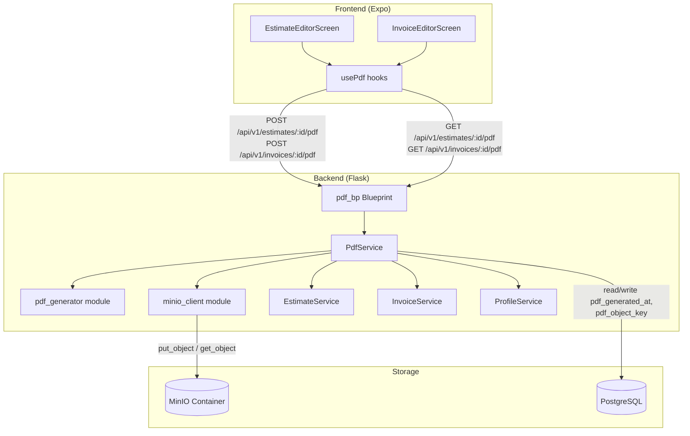

# Design Document: PDF Export

## Overview

This feature adds PDF generation and download capabilities for estimates and invoices in SiteKeeper. Contractors can generate a professional PDF from any estimate or invoice, download it later, and see at a glance whether a previously generated PDF is stale (the underlying document changed since the PDF was created).

The system uses ReportLab for server-side PDF rendering and MinIO (S3-compatible blob storage) for PDF file storage. MinIO runs as a Docker container alongside the existing PostgreSQL containers in both development and production. The backend exposes two new endpoints per document type (generate and download), and the frontend adds Generate/Download buttons to the existing estimate and invoice editor screens.

### Key Design Decisions

1. **MinIO over filesystem storage** — Decouples PDF files from the application server filesystem. MinIO is S3-compatible, so migrating to AWS S3 later requires only changing the endpoint configuration.
2. **ReportLab over HTML-to-PDF** — ReportLab generates PDFs directly from Python without needing a headless browser. It's lightweight, well-maintained, and gives precise control over layout.
3. **minio-py over boto3** — The `minio` Python SDK is simpler and purpose-built for MinIO. boto3 is overkill for a single-bucket use case.
4. **Staleness via timestamp comparison** — Rather than hashing document content, we compare `updated_at` against `pdf_generated_at`. This is simple, reliable, and aligns with the existing `updated_at` pattern on estimates and invoices.
5. **Overwrite-in-place storage** — Each document gets a single object key (UUID-based). Regenerating overwrites the same key, avoiding orphaned files and simplifying cleanup.
6. **PDF actions on editor screens** — The requirements reference a "Document_Detail_Sheet" but the existing codebase uses full-page editor screens (EstimateEditorScreen, InvoiceEditorScreen) rather than bottom sheets. The PDF actions will be added to these editor screens as action buttons, consistent with the existing UI pattern.

## Architecture



### Request Flow — Generate PDF

1. Frontend calls `POST /api/v1/estimates/{id}/pdf` (or invoices equivalent)
2. `pdf_bp` validates auth, delegates to `PdfService.generate_pdf()`
3. `PdfService` loads the estimate/invoice via the existing service, loads line items, loads user profile, resolves primary contact and job site address
4. `PdfService` calls `pdf_generator.build_pdf()` which returns PDF bytes using ReportLab
5. `PdfService` calls `minio_client.upload_pdf()` to store the bytes in MinIO
6. `PdfService` updates `pdf_generated_at` and `pdf_object_key` on the estimate/invoice record
7. Blueprint returns the updated document with `pdf_status`

### Request Flow — Download PDF

1. Frontend calls `GET /api/v1/estimates/{id}/pdf` (or invoices equivalent)
2. `pdf_bp` validates auth, delegates to `PdfService.get_pdf()`
3. `PdfService` verifies the document has a `pdf_object_key`, retrieves bytes from MinIO via `minio_client.download_pdf()`
4. Blueprint returns the PDF bytes with `Content-Type: application/pdf` and `Content-Disposition: attachment`

## Components and Interfaces

### 1. Database Migration (`backend/migrations/versions/006_pdf_columns.py`)

Adds two nullable columns to both `estimates` and `invoices` tables:
- `pdf_generated_at TIMESTAMPTZ` — when the PDF was last generated
- `pdf_object_key TEXT` — the MinIO object key for the stored PDF

### 2. Model Changes (`backend/app/models.py`)

Add `pdf_generated_at` and `pdf_object_key` columns to both `Estimate` and `Invoice` models.

### 3. MinIO Client Module (`backend/app/minio_client.py`)

A thin wrapper around the `minio` Python SDK. Responsible for:
- Initializing the MinIO client from environment variables
- Ensuring the storage bucket exists on first use
- Uploading PDF bytes to a given object key
- Downloading PDF bytes by object key
- Reporting connection errors clearly

```python
# Interface sketch
class MinioStorage:
    def __init__(self, endpoint: str, access_key: str, secret_key: str,
                 bucket_name: str, use_ssl: bool = False):
        ...

    def ensure_bucket(self) -> None:
        """Create the bucket if it doesn't exist."""
        ...

    def upload(self, object_key: str, data: bytes, content_type: str = "application/pdf") -> None:
        """Upload bytes to the bucket."""
        ...

    def download(self, object_key: str) -> bytes:
        """Download and return bytes from the bucket."""
        ...
```

### 4. PDF Generator Module (`backend/app/pdf_generator.py`)

A pure function module that takes structured data and returns PDF bytes. No database or storage access — this keeps it testable.

```python
@dataclass
class PdfData:
    document_type: str          # "Estimate" or "Invoice"
    title: str
    # User profile
    company_name: str | None
    user_name: str | None
    user_phone: str | None
    user_email: str
    payment_method: str | None
    # Bill to
    bill_to_name: str | None
    # Job site
    job_site_address: str | None
    # Line items with entries
    line_items: list[PdfLineItem]
    # Tax
    tax_rate: Decimal | None
    subtotal: Decimal
    tax_amount: Decimal
    total: Decimal

@dataclass
class PdfLineItem:
    name: str
    hourly_rate: Decimal | None
    material_entries: list[PdfMaterialEntry]
    hours_entries: list[PdfHoursEntry]

@dataclass
class PdfMaterialEntry:
    name: str
    unit_price: Decimal
    quantity: Decimal
    total: Decimal

@dataclass
class PdfHoursEntry:
    name: str
    hours: Decimal
    hourly_rate: Decimal
    total: Decimal

def build_pdf(data: PdfData) -> bytes:
    """Generate a PDF document and return the raw bytes."""
    ...
```

The PDF layout (built with ReportLab):
- **Header**: Company name (if set), user name, phone, email
- **Document type heading**: "Estimate" or "Invoice"
- **Title**: Document title
- **Bill To**: Primary contact name (if set)
- **Job Site Address**: Address (if set)
- **Materials Table**: Grouped by line item, columns: Item/Description, Unit Price, Qty, Total
- **Materials subtotal + tax** (if tax rate set)
- **Hours Table**: Grouped by line item, columns: Item/Description, Hours, Rate, Total
- **Hours total**
- **Grand Total section**: Subtotal, Tax (if applicable), Total
- **Payment method** (if set)
- **Footer**: "Thank you for your business!"

### 5. PDF Service (`backend/app/services/pdf_service.py`)

Orchestrates PDF generation and download. Follows the existing service pattern with dependency injection.

```python
class PdfService:
    def __init__(self, estimate_service=None, invoice_service=None,
                 profile_service=None, minio_storage=None):
        ...

    def generate_estimate_pdf(self, estimate_id: str, user_id: str) -> dict:
        """Generate PDF for an estimate, store in MinIO, update DB columns.
        Returns serialized estimate with pdf_status."""
        ...

    def generate_invoice_pdf(self, invoice_id: str, user_id: str) -> dict:
        """Generate PDF for an invoice, store in MinIO, update DB columns.
        Returns serialized invoice with pdf_status."""
        ...

    def download_estimate_pdf(self, estimate_id: str, user_id: str) -> tuple[bytes, str]:
        """Return (pdf_bytes, filename) for an estimate's PDF."""
        ...

    def download_invoice_pdf(self, invoice_id: str, user_id: str) -> tuple[bytes, str]:
        """Return (pdf_bytes, filename) for an invoice's PDF."""
        ...
```

### 6. PDF Blueprint (`backend/app/blueprints/pdf_bp.py`)

New blueprint registered at `/api/v1`. Four routes:

| Method | Path | Description |
|--------|------|-------------|
| `POST` | `/estimates/<id>/pdf` | Generate PDF for estimate |
| `GET` | `/estimates/<id>/pdf` | Download PDF for estimate |
| `POST` | `/invoices/<id>/pdf` | Generate PDF for invoice |
| `GET` | `/invoices/<id>/pdf` | Download PDF for invoice |

### 7. Serializer Changes

Update `_serialize_estimate()` in `estimates_bp.py` and `_serialize_invoice()` in `invoices_bp.py` to include `pdf_status`:

```python
def _compute_pdf_status(doc) -> str:
    if doc.pdf_generated_at is None:
        return "none"
    if doc.updated_at > doc.pdf_generated_at:
        return "stale"
    return "current"
```

Add `"pdf_status": _compute_pdf_status(estimate)` to the serialized output.

### 8. Frontend Types (`frontend/src/api/types.ts`)

Add `pdf_status: "none" | "current" | "stale"` to both `Estimate` and `Invoice` interfaces.

### 9. Frontend Hooks (`frontend/src/api/hooks/usePdf.ts`)

```typescript
// New hooks
export function useGenerateEstimatePdf()   // POST /estimates/:id/pdf
export function useDownloadEstimatePdf()   // GET /estimates/:id/pdf (triggers file download)
export function useGenerateInvoicePdf()    // POST /invoices/:id/pdf
export function useDownloadInvoicePdf()    // GET /invoices/:id/pdf (triggers file download)
```

Generation mutations invalidate the estimate/invoice detail query to pick up the new `pdf_status`.

For download on web: use `window.open()` or create a temporary `<a>` element with the download URL and auth token as a query parameter (or use a blob URL from an authenticated fetch). On native: use `expo-file-system` + `expo-sharing` if needed, but since this is primarily a web app, the web approach is the priority.

### 10. Frontend UI Changes

**EstimateEditorScreen** and **InvoiceEditorScreen** — add a PDF actions section below the grand total block:

- **When `pdf_status === "none"`**: Show "Generate PDF" button
- **When `pdf_status === "current"`**: Show "Download PDF" button and a secondary "Regenerate PDF" button
- **When `pdf_status === "stale"`**: Show a warning badge ("PDF is outdated") and "Generate PDF" button. Hide "Download PDF".

While generating: show a loading spinner on the button.

### 11. Docker Compose Changes

**`docker-compose.yml` (dev)**:
```yaml
minio:
  image: minio/minio
  command: server /data --console-address ":9001"
  restart: unless-stopped
  environment:
    MINIO_ROOT_USER: ${MINIO_ROOT_USER:-minioadmin}
    MINIO_ROOT_PASSWORD: ${MINIO_ROOT_PASSWORD:-minioadmin}
  ports:
    - "9000:9000"   # S3 API
    - "9001:9001"   # Web console
  volumes:
    - minio_data:/data
```

**`docker-compose.prod.yml`** (new file):
```yaml
minio:
  image: minio/minio
  command: server /data --console-address ":9001"
  restart: unless-stopped
  environment:
    MINIO_ROOT_USER: ${MINIO_ROOT_USER}
    MINIO_ROOT_PASSWORD: ${MINIO_ROOT_PASSWORD}
  ports:
    - "9000:9000"   # S3 API (localhost only via firewall)
    - "9001:9001"   # Web console
  volumes:
    - minio_data:/data
```

Ports 9000 and 9001 don't conflict with any existing services (5001, 5433, 5434, 5435).

### 12. Environment Variables

| Variable | Dev Default | Production |
|----------|-------------|------------|
| `MINIO_ENDPOINT` | `localhost:9000` | `localhost:9000` |
| `MINIO_ACCESS_KEY` | `minioadmin` | (set in server .env) |
| `MINIO_SECRET_KEY` | `minioadmin` | (set in server .env) |
| `MINIO_BUCKET_NAME` | `sitekeeper-pdfs` | `sitekeeper-pdfs` |
| `MINIO_USE_SSL` | `false` | `false` (MinIO is on localhost) |

### 13. Deploy Script Changes

Add to `deploy_backend()` in `deploy.sh`:
```bash
info "  Starting/updating Docker containers..."
ssh "$SSH_HOST" "
    sudo -u sitekeeper docker compose -f $APP_DIR/docker-compose.prod.yml up -d 2>&1
"
```

This ensures the MinIO container is running alongside the DB container on each deploy.

### 14. Dependencies

Add to `backend/requirements.txt`:
- `reportlab` — PDF generation
- `minio` — MinIO Python SDK

## Data Models

### Database Schema Changes

```sql
-- Migration 006: Add PDF columns to estimates and invoices

ALTER TABLE estimates
    ADD COLUMN pdf_generated_at TIMESTAMPTZ,
    ADD COLUMN pdf_object_key TEXT;

ALTER TABLE invoices
    ADD COLUMN pdf_generated_at TIMESTAMPTZ,
    ADD COLUMN pdf_object_key TEXT;
```

### Updated Estimate Model

```python
class Estimate(db.Model):
    # ... existing columns ...
    pdf_generated_at = Column(TIMESTAMP(timezone=True), nullable=True)
    pdf_object_key = Column(Text, nullable=True)
```

### Updated Invoice Model

```python
class Invoice(db.Model):
    # ... existing columns ...
    pdf_generated_at = Column(TIMESTAMP(timezone=True), nullable=True)
    pdf_object_key = Column(Text, nullable=True)
```

### MinIO Object Key Format

Object keys follow the pattern: `estimates/{estimate_id}.pdf` or `invoices/{invoice_id}.pdf`

This uses the document's existing UUID as the key, ensuring uniqueness and making it easy to locate objects. Regeneration overwrites the same key.

### PDF Status Derivation

The `pdf_status` field is computed, not stored:

```
if pdf_generated_at is NULL → "none"
if updated_at > pdf_generated_at → "stale"
else → "current"
```

### Updated Frontend Types

```typescript
export interface Estimate {
  // ... existing fields ...
  pdf_status: "none" | "current" | "stale";
}

export interface Invoice {
  // ... existing fields ...
  pdf_status: "none" | "current" | "stale";
}
```


## Correctness Properties

*A property is a characteristic or behavior that should hold true across all valid executions of a system — essentially, a formal statement about what the system should do. Properties serve as the bridge between human-readable specifications and machine-verifiable correctness guarantees.*

### Property 1: PDF status computation is correct for all document states

*For any* estimate or invoice with any combination of `updated_at` timestamp, `pdf_generated_at` timestamp (or null), and `pdf_object_key` (or null), the computed `pdf_status` SHALL be exactly one of:
- `"none"` when `pdf_generated_at` is null
- `"stale"` when `pdf_generated_at` is not null and `updated_at > pdf_generated_at`
- `"current"` when `pdf_generated_at` is not null and `updated_at <= pdf_generated_at`

**Validates: Requirements 3.1, 3.2, 3.3, 20.1, 20.2, 20.3, 20.4**

### Property 2: PDF contains document type and title

*For any* valid `PdfData` with a `document_type` of "Estimate" or "Invoice" and any non-empty `title`, the PDF bytes produced by `build_pdf()` SHALL contain both the document type string and the title string when the PDF text is extracted.

**Validates: Requirements 9.1, 9.2**

### Property 3: PDF includes all non-null optional fields and excludes null optional fields

*For any* valid `PdfData`, the PDF bytes produced by `build_pdf()` SHALL contain each non-null optional field value (`company_name`, `user_name`, `user_phone`, `payment_method`, `bill_to_name`, `job_site_address`) in the extracted text, and SHALL NOT contain the section label (e.g. "Bill To") for fields that are null.

**Validates: Requirements 10.1, 10.2, 11.1, 11.2, 12.1, 12.2, 12.3, 12.4, 12.5**

### Property 4: PDF contains all line item entry names

*For any* valid `PdfData` with one or more line items containing material and/or hours entries, the PDF bytes produced by `build_pdf()` SHALL contain the name of every material entry and every hours entry in the extracted text.

**Validates: Requirements 13.1, 14.1**

### Property 5: PDF contains financial summary values

*For any* valid `PdfData`, the PDF bytes produced by `build_pdf()` SHALL contain the formatted `subtotal` and `total` values in the extracted text. When `tax_rate` is non-null and greater than zero, the PDF SHALL also contain the formatted `tax_amount` value.

**Validates: Requirements 13.2, 13.3, 13.4, 14.2, 14.3, 15.1, 15.2, 15.3**

## Error Handling

### Backend Errors

| Scenario | HTTP Status | Error Code | Message |
|----------|-------------|------------|---------|
| Document not found or not owned by user | 404 | `NOT_FOUND` | "Estimate not found." / "Invoice not found." |
| No PDF generated (download attempt) | 404 | `NOT_FOUND` | "No PDF has been generated for this document." |
| MinIO unreachable during generation | 500 | `SERVER_ERROR` | "Failed to store PDF. Please try again." |
| MinIO unreachable during download | 500 | `SERVER_ERROR` | "Failed to retrieve PDF. Please try again." |
| ReportLab generation failure | 500 | `SERVER_ERROR` | "Failed to generate PDF. Please try again." |
| Missing MinIO env var at startup | N/A | Logged | "Missing required environment variable: MINIO_ENDPOINT" (etc.) |

All error responses use the existing `error_response()` / `not_found()` / `server_error()` helpers from `blueprints/helpers.py` to maintain the consistent error envelope format.

### Frontend Error Handling

- **Generation failure**: Display an inline error message below the Generate PDF button (e.g. "Failed to generate PDF. Please try again."). Use the existing error pattern from the editor screens.
- **Download failure**: Display an alert or inline error. If the PDF was deleted from MinIO but the DB still has a key, the 500 error will prompt the user to regenerate.
- **Network errors**: Handled by the existing Axios interceptor (401 → logout, other errors → reject promise).

### MinIO Startup

The `MinioStorage.ensure_bucket()` method is called during app initialization (in `create_app()`). If MinIO is unreachable at startup, the app logs a warning but still starts — PDF endpoints will return 500 errors until MinIO becomes available. This avoids blocking the entire API if MinIO is temporarily down.

## Testing Strategy

### Property-Based Tests (Hypothesis)

The project already uses Hypothesis (`hypothesis==6.135.0` in requirements.txt). Property-based tests will use Hypothesis to generate random `PdfData` instances and verify the five correctness properties.

**Configuration**: Minimum 100 iterations per property test via `@settings(max_examples=100)`.

**Tag format**: Each test is tagged with a comment referencing the design property:
```python
# Feature: pdf-export, Property 1: PDF status computation is correct for all document states
```

**Test file**: `backend/tests/test_pdf_properties.py`

Property tests cover:
1. `_compute_pdf_status()` — pure function, no DB needed
2. `build_pdf()` — pure function taking `PdfData`, returning bytes. Text extraction via `pdfplumber` or ReportLab's built-in text extraction to verify content.

### Unit Tests (pytest)

**Test file**: `backend/tests/test_pdf_unit.py`

- `_compute_pdf_status()` with specific examples: no PDF, current PDF, stale PDF
- `build_pdf()` with a known `PdfData` fixture — verify "Thank you for your business!" appears (Req 16.1)
- `build_pdf()` with empty line items — verify PDF still generates without errors
- `MinioStorage` initialization with missing env vars — verify error logging
- `PdfService` with mocked dependencies — verify correct orchestration

### Integration Tests (pytest)

**Test file**: `backend/tests/test_pdf_integration.py`

- Full generate → download flow with a test MinIO instance (or mocked MinIO)
- Generate PDF, verify DB columns (`pdf_generated_at`, `pdf_object_key`) are set
- Generate PDF twice, verify object key is reused (overwrite behavior)
- Download without prior generation → 404
- Generate/download with unauthorized user → 404
- Verify `pdf_status` field appears in estimate/invoice GET responses

### Frontend Tests

- Verify "Generate PDF" button renders when `pdf_status === "none"`
- Verify "Download PDF" button renders when `pdf_status === "current"`
- Verify stale warning renders when `pdf_status === "stale"`
- Verify "Download PDF" is hidden when `pdf_status === "stale"`

### Smoke Tests

- Docker Compose files contain MinIO service with correct configuration
- Environment variables are read by Config class
- Deploy script includes docker compose up command
