# SiteKeeper Database Schema

```mermaid
erDiagram
    %% ===== USERS =====
    users {
        UUID id PK
        VARCHAR(255) email UK
        TEXT password_hash
        VARCHAR(255) name
        VARCHAR(2) state
        VARCHAR(255) company_name
        VARCHAR(50) phone
        VARCHAR(255) payment_method
        VARCHAR(500) address
        VARCHAR(20) role "admin | member"
        BOOLEAN is_approved
        TIMESTAMPTZ created_at
    }

    %% ===== CONTACTS =====
    contacts {
        UUID id PK
        VARCHAR(255) name
        VARCHAR(50) phone
        VARCHAR(255) email
        TEXT mailing_address
        TEXT notes
        TIMESTAMPTZ created_at
    }

    %% ===== JOB SITES =====
    job_sites {
        UUID id PK
        UUID user_id FK
        VARCHAR(255) name
        TEXT description
        TEXT address
        UUID primary_contact_id FK
        TIMESTAMPTZ created_at
        TIMESTAMPTZ updated_at
    }

    %% ===== JOBS =====
    jobs {
        UUID id PK
        UUID job_site_id FK
        VARCHAR(255) name
        VARCHAR(50) status "default: pending"
        TEXT description
        UUID primary_contact_id FK
        TIMESTAMPTZ finished_at
        TIMESTAMPTZ created_at
        TIMESTAMPTZ updated_at
    }

    %% ===== NOTES =====
    notes {
        UUID id PK
        UUID job_id FK
        TEXT body
        TIMESTAMPTZ created_at
        TIMESTAMPTZ updated_at
    }

    %% ===== ESTIMATES =====
    estimates {
        UUID id PK
        UUID job_id FK
        VARCHAR(255) title
        BOOLEAN delivered
        NUMERIC(6_4) tax_rate "percentage, nullable"
        TIMESTAMPTZ created_at
        TIMESTAMPTZ updated_at
        TIMESTAMPTZ pdf_generated_at
        TEXT pdf_object_key
        VARCHAR(50) document_number
        DATE document_date
        TEXT bill_to
        VARCHAR(255) company_name
        VARCHAR(255) user_name
        VARCHAR(50) user_phone
        VARCHAR(255) user_email
        VARCHAR(255) payment_method
        VARCHAR(500) business_address
        VARCHAR(500) worksite_address
        TEXT notes
        BOOLEAN show_document_number
        BOOLEAN show_document_date
        BOOLEAN show_bill_to
        BOOLEAN show_company_name
        BOOLEAN show_user_name
        BOOLEAN show_user_phone
        BOOLEAN show_user_email
        BOOLEAN show_payment_method
        BOOLEAN show_business_address
        BOOLEAN show_worksite_address
        BOOLEAN show_notes
    }

    %% ===== INVOICES =====
    invoices {
        UUID id PK
        UUID job_id FK
        VARCHAR(255) title
        UUID source_estimate_id FK "nullable"
        BOOLEAN delivered
        NUMERIC(6_4) tax_rate "percentage, nullable"
        TIMESTAMPTZ created_at
        TIMESTAMPTZ updated_at
        TIMESTAMPTZ pdf_generated_at
        TEXT pdf_object_key
        VARCHAR(50) document_number
        DATE document_date
        TEXT bill_to
        VARCHAR(255) company_name
        VARCHAR(255) user_name
        VARCHAR(50) user_phone
        VARCHAR(255) user_email
        VARCHAR(255) payment_method
        VARCHAR(500) business_address
        VARCHAR(500) worksite_address
        TEXT notes
        BOOLEAN show_document_number
        BOOLEAN show_document_date
        BOOLEAN show_bill_to
        BOOLEAN show_company_name
        BOOLEAN show_user_name
        BOOLEAN show_user_phone
        BOOLEAN show_user_email
        BOOLEAN show_payment_method
        BOOLEAN show_business_address
        BOOLEAN show_worksite_address
        BOOLEAN show_notes
    }

    %% ===== LINE ITEMS (polymorphic: estimate or invoice) =====
    line_items {
        UUID id PK
        UUID parent_id "FK to estimates or invoices"
        VARCHAR(20) parent_type "estimate | invoice"
        VARCHAR(255) name
        TEXT notes
        NUMERIC(12_4) hourly_rate
        INTEGER sort_order
    }

    %% ===== LINE ITEM ENTRIES =====
    line_item_entries {
        UUID id PK
        UUID line_item_id FK
        VARCHAR(20) entry_type "material | hours"
        VARCHAR(255) name
        TEXT notes
        TEXT url
        NUMERIC(12_4) unit_price "material only"
        NUMERIC(12_4) quantity "material only"
        NUMERIC(12_4) hours "hours only"
        INTEGER sort_order
    }

    %% ===== SAVED ITEMS (reusable templates) =====
    saved_items {
        UUID id PK
        UUID user_id FK
        VARCHAR(255) name
        TEXT notes
        NUMERIC(12_4) hourly_rate
        TIMESTAMPTZ created_at
        TIMESTAMPTZ updated_at
    }

    %% ===== SAVED ITEM ENTRIES =====
    saved_item_entries {
        UUID id PK
        UUID saved_item_id FK "nullable (standalone entries)"
        UUID user_id FK "nullable"
        VARCHAR(20) entry_type "material | hours"
        VARCHAR(255) name
        TEXT notes
        TEXT url
        NUMERIC(12_4) unit_price "material only"
        NUMERIC(12_4) quantity "material only"
        NUMERIC(12_4) hours "hours only"
        INTEGER sort_order
    }

    %% ===== DOCUMENT NUMBERS (auto-increment tracker) =====
    document_numbers {
        UUID id PK
        VARCHAR(20) document_type "estimate | invoice"
        INTEGER next_number
    }

    %% ===== JUNCTION TABLES =====
    job_site_contacts {
        UUID job_site_id FK
        UUID contact_id FK
    }

    job_contacts {
        UUID job_id FK
        UUID contact_id FK
    }

    %% ===== RELATIONSHIPS =====

    users ||--o{ job_sites : "creates"
    users ||--o{ saved_items : "owns"

    job_sites ||--o{ jobs : "contains"
    job_sites }o--o| contacts : "primary_contact"

    jobs ||--o{ notes : "has"
    jobs ||--o{ estimates : "has"
    jobs ||--o{ invoices : "has"
    jobs }o--o| contacts : "primary_contact"

    estimates ||--o{ line_items : "has (parent_type=estimate)"
    invoices ||--o{ line_items : "has (parent_type=invoice)"
    invoices }o--o| estimates : "source_estimate"

    line_items ||--o{ line_item_entries : "contains"

    saved_items ||--o{ saved_item_entries : "contains"
    users ||--o{ saved_item_entries : "owns (standalone)"

    job_site_contacts }o--|| job_sites : ""
    job_site_contacts }o--|| contacts : ""

    job_contacts }o--|| jobs : ""
    job_contacts }o--|| contacts : ""
```

## Notes

- **Multi-tenancy**: Each tenant has its own isolated database. This schema is replicated per tenant.
- **UUIDs**: All primary keys are UUID v4, generated by PostgreSQL's `gen_random_uuid()`.
- **Polymorphic line items**: `line_items.parent_id` references either `estimates.id` or `invoices.id`, distinguished by `parent_type`. No FK constraint at the DB level; integrity is enforced in the service layer.
- **Saved items**: Templates that can be reused across estimates/invoices. `saved_item_entries` with `saved_item_id = NULL` are standalone entries in the Materials Library.
- **Cascade deletes**: Enforced at the database level via `ON DELETE CASCADE` on all child foreign keys.
- **Timestamps**: All stored as `TIMESTAMPTZ` (UTC).
